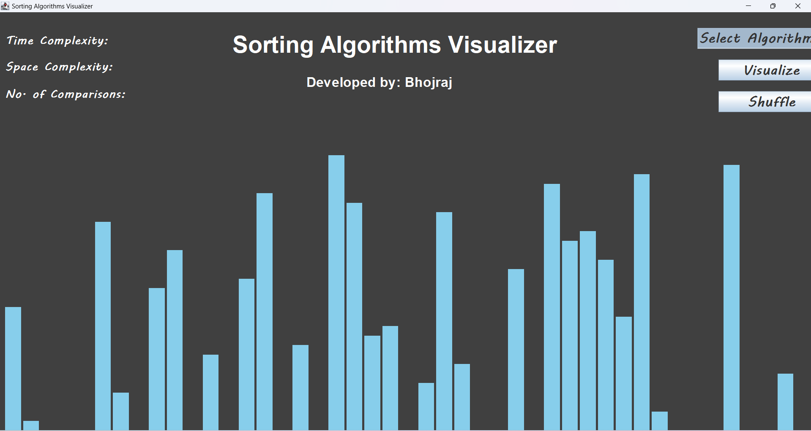
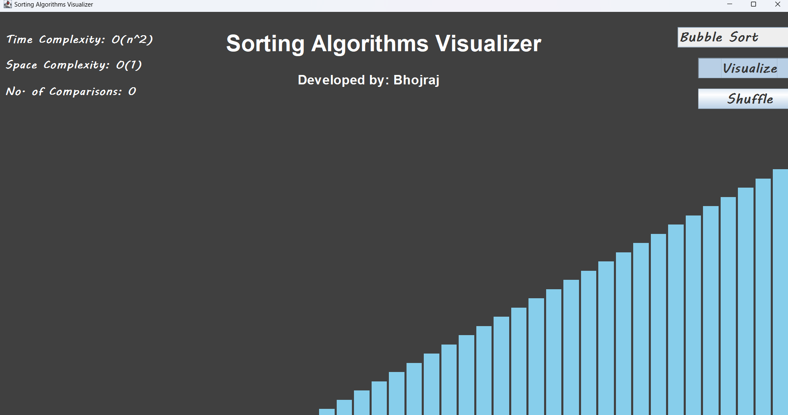

Here's the corrected version of your `README.md` file:

---

# AlgoSort Visualizer
A powerful and interactive tool to visualize the process of sorting algorithms, including **Merge Sort**, **Heap Sort**, **Insertion Sort**, **Bubble Sort**, and **Quick Sort**. See how these algorithms work with dynamic animations.

## Features
- **Real-time visualization** of sorting algorithms.
- Includes multiple algorithms: **Bubble Sort**, **Heap Sort**, **Insertion Sort**, **Merge Sort**, and **Quick Sort**.
- View time and space complexities for each algorithm.
- Count the number of comparisons made during sorting.

## Installation

### Windows

1. **Install Java Development Kit (JDK)**:
   - Download the latest JDK from the [Oracle JDK download page](https://www.oracle.com/java/technologies/javase-jdk17-downloads.html) or [OpenJDK](https://openjdk.java.net/).
   - Follow the installation instructions to install the JDK.

2. **Verify Java Installation**:
   After installation, open the Command Prompt (`cmd`) and run:
   ```bash
   javac -version
   ```
   You should see output like:
   ```bash
   javac 11.0.14
   ```

3. **Clone the repository**:
   - Clone the repository to your local machine:
   ```bash
   git clone https://github.com/BhojrajCSE21/AlgoSort-Visualizer.git
   cd AlgoSort-Visualizer
   ```

4. **Compile the Java files**:
   - Open Command Prompt and navigate to the project directory.
   - Compile the Java files using the following command:
   ```bash
   javac Main.java
   ```

5. **Run the Application**:
   - Once compiled, run the program with:
   ```bash
   java Main
   ```

6. **Enjoy the visualizer**:
   - The GUI window will open, and you can select sorting algorithms and visualize them in action.

## Visualization Output

Here’s a preview of how the visualizer looks:




## Contributions

Feel free to fork the project and create pull requests. Contributions are welcome to improve the features and algorithms available for visualization.

---

Let me know if you need further adjustments!
